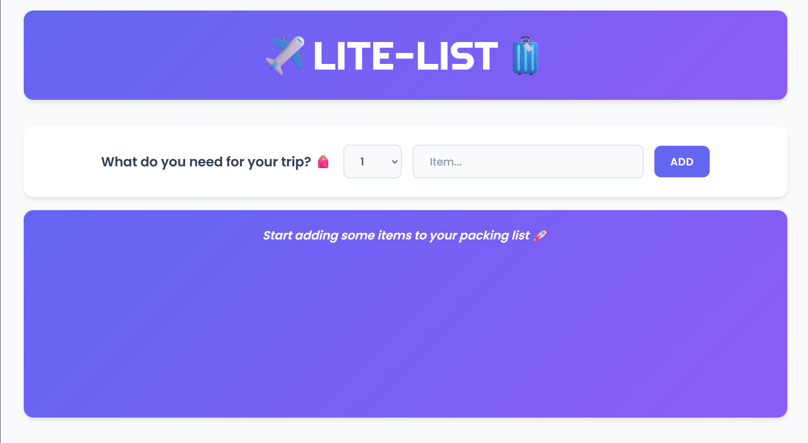
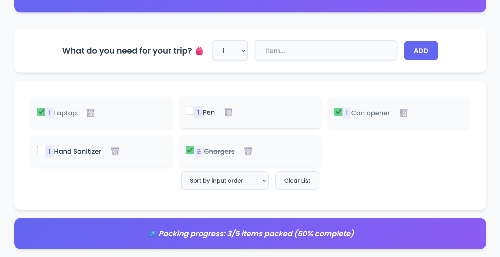

# 🧳 Travel List App

A modern travel packing list application built with React and Vite. Easily manage items you need for your trips with a clean, intuitive interface.

## 🌐 Live Demo

Check out the live application: [https://lite-list.netlify.app/](https://lite-list.netlify.app/)

## ✨ Features

- Add items with quantities to your packing list
- Mark items as packed/unpacked
- Delete items from your list
- Sort items by input order, description, or packed status
- Clear the entire list with confirmation
- Beautiful UI with modern design
- Smooth animations for adding and removing items

## 📷 Screenshots

### Main Application View


### App in Action


## 🚀 Getting Started

### Prerequisites
- Node.js (version 14 or higher)
- npm or yarn

### Installation

1. Clone the repository
```bash
git clone https://github.com/Sarthaklm10/Lite-List.git
cd travel-list
```

2. Install dependencies
```bash
npm install
# or
yarn
```

3. Start the development server
```bash
npm run dev
# or
yarn dev
```

4. Open your browser and navigate to http://localhost:5173

## 🛠️ Built With

- [React](https://reactjs.org/) - UI Library
- [Vite](https://vitejs.dev/) - Build Tool
- Modern CSS with animations

## 📝 Usage

1. Enter the quantity and description of an item you need for your trip
2. Click "Add" or press Enter to add it to your list
3. Check items once you've packed them
4. Use the sorting options to organize your list
5. Clear the list when your trip is complete
